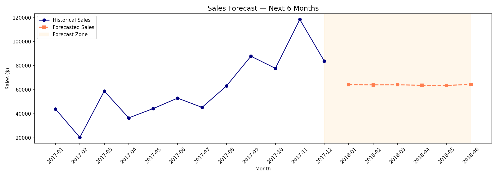
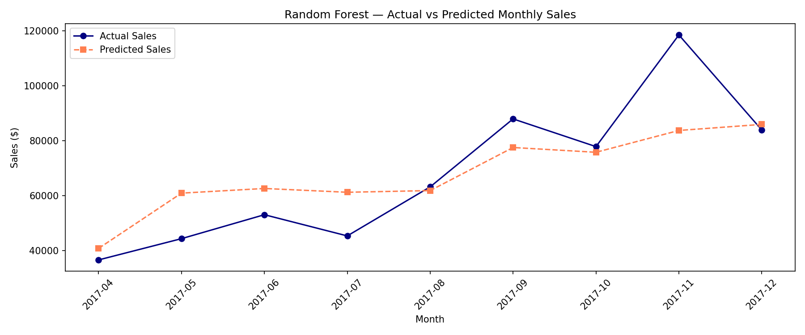
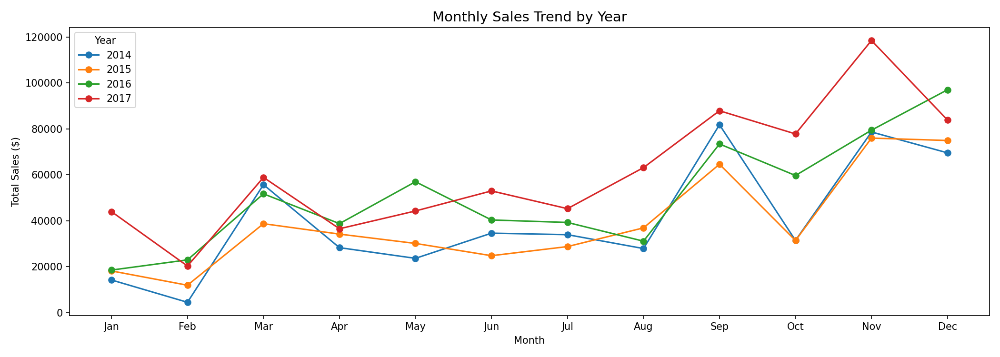
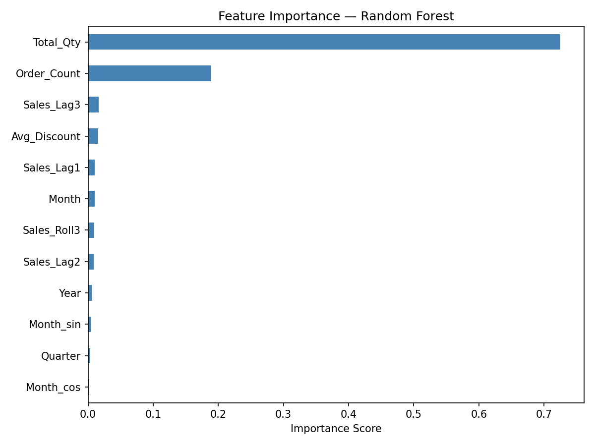

# 📈 Sales & Demand Forecasting System
**Machine Learning Task 1 | Future Interns**

## 🎯 Project Overview
This system predicts future sales based on historical business data. It helps store owners and managers plan inventory, manage cash flow, and avoid overstocking.

## 📊 Project Preview
## 📊 Project Visualizations
<table>
  <tr>
    <td><b>Sales Forecast (Future Predictions)</b></td>
    <td><b>Model Accuracy (Actual vs Predicted)</b></td>
  </tr>
  <tr>
    <td></td>
    <td></td>
  </tr>
  <tr>
    <td><b>Monthly Sales Trends</b></td>
    <td><b>Top Drivers (Feature Importance)</b></td>
  </tr>
  <tr>
    <td></td>
    <td></td>
  </tr>
</table>
## 📁 Repository Structure
- `data/`: Raw and cleaned datasets.
- `models/`: Trained model files (e.g., .pkl or .joblib).
- `notebooks/`: Jupyter Notebooks with EDA and model training.
- `outputs screenshots/`: Visualizations and performance charts.

## 🛠️ Tech Stack
- **Language:** Python
- **Libraries:** Pandas, NumPy, Scikit-learn, Matplotlib, Seaborn.

## 🚀 Key Insights for Business
- **Trend Analysis:** Identified peak sales periods during [Insert Month/Season].
- **Inventory Planning:** Recommended increasing stock for [Product Category] by 20% before peak periods to avoid losses.

## ⚙️ How to Run
1. Install dependencies: `pip install -r requirements.txt`
2. Run the notebook in the `notebooks/` folder.
